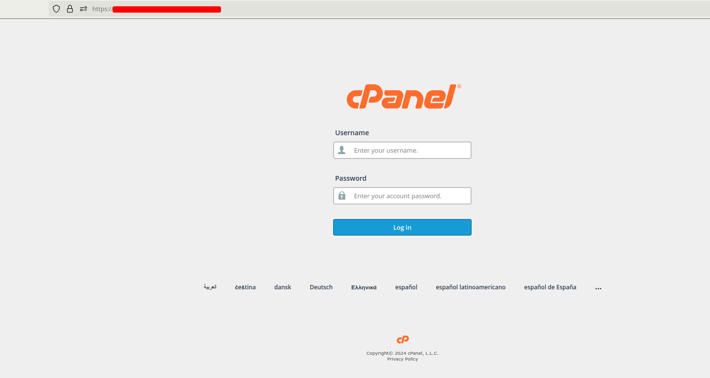

### How to Add an Addon Domain in cPanel

Adding an addon domain in cPanel allows you to host multiple domains on a single hosting account. This is particularly useful if you want to manage multiple websites from a single control panel. In this guide, we will walk you through the steps to add an addon domain in cPanel.

#### Step-by-Step Guide to Adding an Addon Domain

1. **Log in to Your cPanel Account**

   First, log in to your cPanel account using your username and password. You can usually access cPanel by navigating to `yourcooldomain.com/cpanel` in your web browser.  

   

2. **Navigate to the Domains Section**

   Once you're logged in, Head over to the "Domains" section. Click on "Create a New Domain" to open the domain management interface.  

   

3. **Enter the New Domain Information**

   In the Domains interface, you will see a form to add your new domain. You need to provide the following information:

   - **New Domain Name**: Enter the domain name you want to add (e.g., `example.com`).
   - **Subdomain**: This will be automatically filled based on the domain name you enter. You can leave it as it is.
   - **Document Root**: This is the directory where the files for your new domain will be stored. It will be automatically filled based on the domain name you enter, but you can change it if needed.  
   `Note : Uncheck the share document root`  

4. **Click "Add Domain"**

   After filling in all the required information, click the "Submit" button. cPanel will create the addon domain and set up the necessary directory structure.

   
5. **Upload Your Website Files**

   Now that the addon domain has been added, you can upload your website files to the document root directory specified earlier. You can use the cPanel File Manager or an FTP client to upload your files.

6. **Configure DNS Settings**

   If your domain is registered with a different provider, you will need to update the DNS settings to point to your hosting server. Typically, you will need to set the nameservers to those provided by your hosting provider.

#### Conclusion

Adding an addon domain in cPanel is a straightforward process that allows you to manage multiple websites from a single hosting account. By following the steps outlined in this guide, you can easily set up and configure an addon domain to host your new website.

