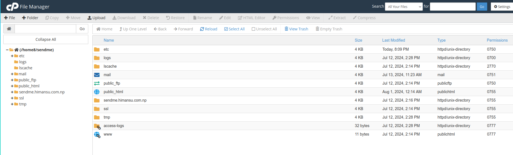
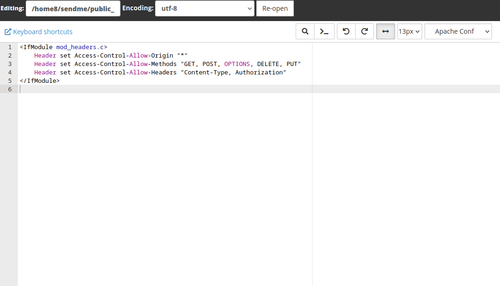

## Introduction

Enabling Cross-Origin Resource Sharing (CORS) is essential for web applications that need to request resources from different domains. This guide will walk you through the steps to enable CORS in cPanel, ensuring your web application can securely interact with external APIs and services.

## Step-by-Step Guide

### 1. Access cPanel

First, log in to your cPanel account using your username and password.  


### 2. Open File Manager

Navigate to the **File Manager**. This is typically found in the **Files** section of the cPanel dashboard.  




### 3. Locate .htaccess File

- In the File Manager, navigate to the root directory of your website. This is usually the `public_html` directory.
- Look for the `.htaccess` file. If you don't see it, ensure that hidden files are visible by clicking on **Settings** in the top-right corner and checking **Show Hidden Files (dotfiles)**.

### 4. Edit .htaccess File

- Right-click on the `.htaccess` file and select **Edit**.
- If a dialog box appears, click **Edit** again to proceed.

**You may need to create a new files (.htacess), if you are unable to locate it even after enabling show hidden files**
### 5. Add CORS Configuration

Add the following lines to the `.htaccess` file to enable CORS:

```apache
<IfModule mod_headers.c>
    Header set Access-Control-Allow-Origin "*"
    Header set Access-Control-Allow-Methods "GET, POST, OPTIONS, DELETE, PUT"
    Header set Access-Control-Allow-Headers "Content-Type, Authorization"
</IfModule>
```  

- Access-Control-Allow-Origin: Specifies the domains allowed to access the resources. Replace * with your specific domain if you want to restrict access.
- Access-Control-Allow-Methods: Lists the HTTP methods that are allowed.
- Access-Control-Allow-Headers: Lists the headers allowed in the actual request.

 

### 6. Save Changes
After adding the configuration, click **Save Changes** to apply the settings.

### 7. Verify CORS Configuration

To ensure CORS is enabled, you can use browser developer tools or an online CORS testing tool like [CORS Test](https://cors-test.codehappy.dev/). Make a request from a different origin to your server and check the response headers for the **Access-Control-Allow-Origin** header.

## Conclusion

Enabling CORS in cPanel is a straightforward process that enhances the functionality of your web applications by allowing secure cross-origin requests. By following the steps outlined above, you can ensure your applications can interact with external resources seamlessly.