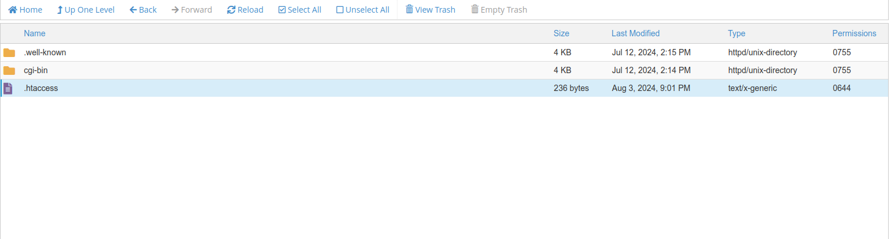
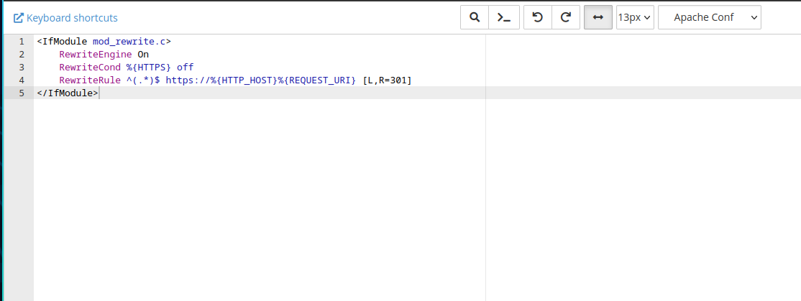

## Introduction

Enabling HTTPS for your website is essential to ensure secure communication between the server and the clients. This guide will show you how to force HTTPS using the `.htaccess` file.

## Prerequisites

- Access to your cPanel account or FTP to edit the `.htaccess` file.
- An SSL certificate installed on your server.

## Steps to Enable HTTPS from .htaccess

### 1. Access Your .htaccess File

1. **Via cPanel**:
    - Log in to your cPanel account.
    - Navigate to the **File Manager**.
    - Locate and edit the `.htaccess` file in the root directory of your website (usually the `public_html` directory).  



2. **Via FTP**:
    - Connect to your server using an FTP client.
    - Download the `.htaccess` file from the root directory of your website.
    - Open it in a text editor.

### 2. Add Rewrite Rules

Add the following code snippet to your `.htaccess` file to redirect all HTTP traffic to HTTPS:

```apache
<IfModule mod_rewrite.c>
    RewriteEngine On
    RewriteCond %{HTTPS} off
    RewriteRule ^(.*)$ https://%{HTTP_HOST}%{REQUEST_URI} [L,R=301]
</IfModule>
```
  

### 3. Save and Upload the .htaccess File  
- If you edited the `.htaccess` file via cPanel, simply save the changes.
- If you edited it locally via FTP, upload the modified `.htaccess` file back to your server.

### 4. Verify the Redirection  
Visit your website using `http://` and ensure it redirects to `https://`. You should see the padlock icon in the browser's address bar, indicating a secure connection.

## Troubleshooting   
- Ensure `mod_rewrite` is enabled: If the redirection is not working, make sure the `mod_rewrite` module is enabled on your server.
- Check for syntax errors: Verify that there are no syntax errors in the `.htaccess` file, as they can cause server issues.

## Conclusion  
Forcing HTTPS using the `.htaccess` file is a simple yet effective way to secure your website. This redirection ensures that all traffic to your site is encrypted, providing better security for your users.
