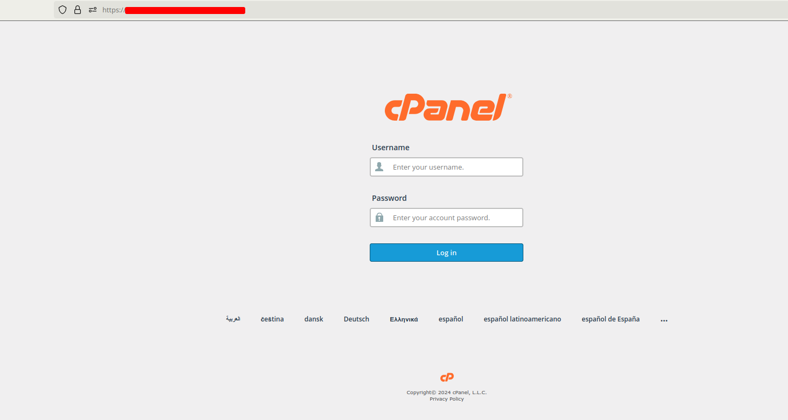
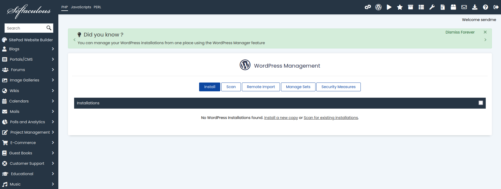
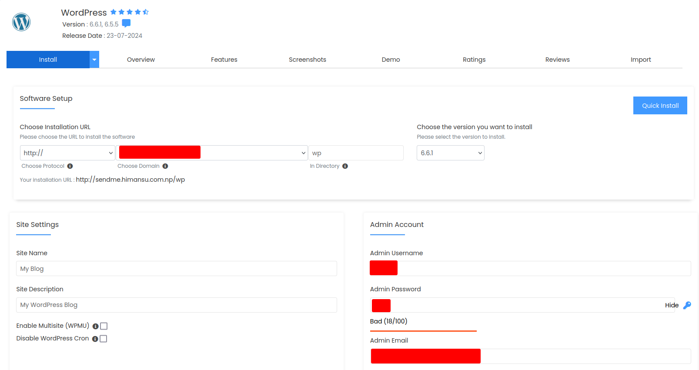
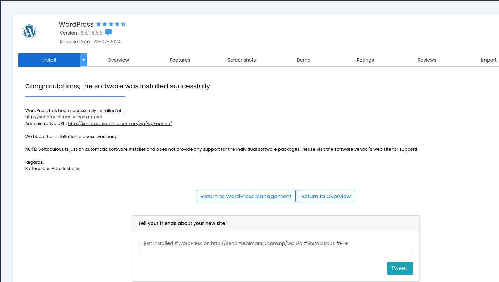

WordPress is one of the most popular content management systems (CMS) available today, and cPanel is a widely used control panel for web hosting. This guide will walk you through the steps to install WordPress using cPanel.

## Prerequisites

Before you begin, ensure that you have:

- Access to cPanel (credentials from your web hosting provider)
- A domain name

## Step-by-Step Guide

### Step 1: Log in to cPanel

First, log in to your cPanel account. You can usually access it by navigating to ```yourdomain.com/cpanel``` and entering your username and password.



### Step 2: Find and Open the WordPress Installer

Once you're logged in, scroll down to the **Software** section and click on **WordPress** under **Site Software** or **Softaculous Apps Installer**, depending on your hosting provider.



### Step 3: Click on the Install Button

In the WordPress installer page, click on the **Install Now** button.

### Step 4: Configure the WordPress Installations

Fill out the necessary details for your WordPress installation:

- **Choose Protocol**: Select `http://` or `https://` depending on your SSL certificate.
- **Choose Domain**: Select the domain where you want to install WordPress.
- **In Directory**: Leave this blank to install WordPress in the root directory, or enter a folder name if you want it installed in a subdirectory.

#### Site Settings

- **Site Name**: Your site's name.
- **Site Description**: A short description of your site.

#### Admin Account

- **Admin Username**: Create a username for the WordPress admin account.
- **Admin Password**: Create a strong password.
- **Admin Email**: Enter your email address.

#### Database Settings

- **Database Name**: You can leave this as is or create a new database name.
- **Table Prefix**: Use the default `wp_` or change it for better security.



### Step 5: Complete the Installation

After filling out the details, scroll down and click the **Install** button. The installation process will take a few 
minutes.

### Step 6: Access Your New WordPress Site

Once the installation is complete, you will see a success message with the URL to your new WordPress site and the admin URL. Click on the links to visit your site and log in to the WordPress admin dashboard.




## Conclusion

Congratulations! You've successfully installed WordPress using cPanel. You can now start customizing your site and creating content. If you encounter any issues, refer to the documentation provided by your hosting provider or the WordPress support forums.

